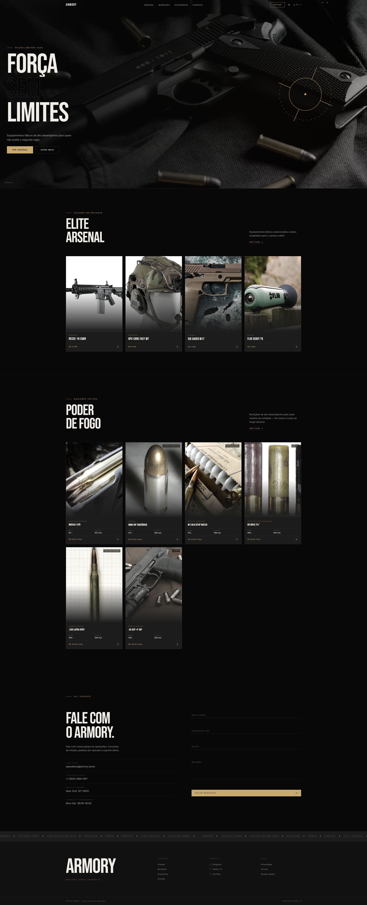
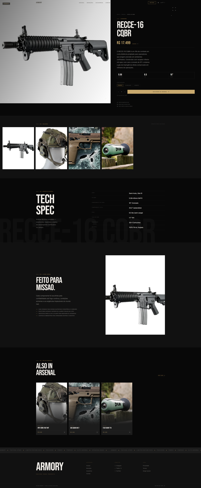

# ARMORY — Premium Tactical Store

A single-page tactical/military-themed storefront built with **vanilla JavaScript (native ESM)**, **GSAP 3**, **Lenis**, and **Tailwind CSS v4**. No bundler — the browser loads ES modules directly.

---

## Preview

| Home | Product Detail |
|------|---------------|
|  |  |

---

## Features

- **Cinematic loader** — animated counter, brand reveal, and progress bar
- **Custom cursor** — tactical targeting brackets that react to hover
- **Smooth scroll** — Lenis-powered momentum scrolling
- **Hero** — full-viewport with parallax background and crosshair SVG
- **Arsenal** — dynamic product grid rendered from data, links to product detail
- **Ammo** — caliber grid with grain/velocity specs
- **Product detail page** — sticky image panel, draggable gallery, tech specs table, overview, related products
- **Contact form** — floating label inputs
- **Auth overlay** — login/register with GSAP form-swap animation
- **i18n** — 4 locales (EN / PT / DE / JP), persisted to `localStorage`
- **Dark / Light theme** — CSS variable swap, hero always stays dark
- **Responsive** — mobile-first, works from 375 px to 4K

---

## Tech Stack

| Layer | Tool |
|-------|------|
| Markup | Semantic HTML5 |
| Styling | Tailwind CSS v4 (no config file) |
| Animation | GSAP 3.12 — ScrollTrigger, Flip, Draggable |
| Smooth scroll | Lenis 1.0 |
| Icons | Lucide |
| Fonts | Bebas Neue (display) · Inter (body) |
| Modules | Native ESM — no bundler |

---

## Project Structure

```
root/
├── index.html              # Landing page
├── product.html            # Product detail (reads ?id= from URL)
├── css/
│   ├── input.css           # Tailwind source — edit this
│   └── output.css          # Generated — never edit manually
├── js/
│   ├── main.js             # Boot orchestrator for index
│   ├── main-product.js     # Boot orchestrator for product page
│   ├── core/               # Cursor, nav, lenis, i18n, theme, auth
│   ├── animations/         # One class per section/feature
│   ├── data/               # products.js, ammo.js, product-specs.js
│   ├── lib/                # SplitText.js (GSAP Club, local copy)
│   └── locales/            # en.js · pt.js · de.js · jp.js
```

---

## Getting Started

**Install dependencies**

```bash
npm install
```

**Build CSS (one-shot)**

```bash
npm run build
```

**Watch mode**

```bash
npm run dev
```

Then open `index.html` directly in a browser (no dev server needed — native ESM works over `file://` in modern browsers, or use any static server like Live Server).

---

## Pages

| URL | Description |
|-----|-------------|
| `index.html` | Full landing page |
| `product.html?id=recce16` | RECCE-16 CQBR detail |
| `product.html?id=opscore` | Ops-Core FAST MT detail |
| `product.html?id=sig-m17` | SIG SAUER M17 detail |
| `product.html?id=flir-tk` | FLIR Scout TK detail |

---

## Design Tokens

| Token | Value |
|-------|-------|
| `--color-black` | `#080808` (dark) / `#f5f0e8` (light) |
| `--color-white` | `#f0ede8` (dark) / `#0d0b08` (light) |
| `--color-gold` | `#c8a96e` |
| `--color-red` | `#b8282a` |
| `--font-display` | Bebas Neue |
| `--font-body` | Inter |

---

## Architecture

Every JS module exports **one ES6 class** with a public API of `prep()` → `init()`. All helpers are `#private`. No module-level state, no named function exports.

```js
// Boot sequence (strict order)
GsapSetup.init();      // register plugins first
product.prep();        // set hidden initial states
new Cursor().init();
new NavMenu().init();
new I18n().init();
new LenisScroll().init();
new Loader().init(() => {
  product.init();      // animations run after loader exits
});
```

---

## License

MIT
